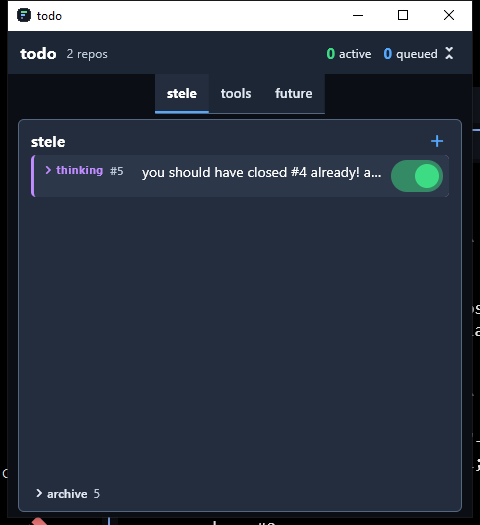

# todo — a task queue Claude Code has to actually work

A small Windows tool that gives [Claude Code](https://claude.com/claude-code) a per-project task
queue, and then **holds it to that queue** using Claude Code's own hooks.

Without it, a coding session drifts: you ask for five things, four get done, one is quietly forgotten,
and you find out a week later. With it:

- Every prompt you send is **recorded verbatim**, so nothing you asked for can appear to have vanished.
- The session is **told the head of the queue** at the start of every turn — and nothing else, so it
  cannot skip ahead to the easy items.
- Work **cannot start** while something you said is still untriaged. The edit is refused, not merely
  discouraged, until your message has been read and turned into tasks.
- A turn **cannot end** while work remains. Claude gets refused and pushed back to the queue.
- When a task is finished it is **archived with a note** saying what was actually done, so "what
  happened to that?" always has an answer.
- When Claude gets stuck it **parks the task with a reason**, and you answer that reason **in the
  window, against the task** — not somewhere up the chat.
- A window shows every project's queue at a glance; pinning it on top is a checkbox.

This repository is where you get it and how you set it up.

---

## What you get

**One zip**, attached to the [latest release](../../releases/latest), so cloning this stays small.
Unzip it anywhere and run `install.cmd` from the project you want queued.

| file | what it is |
|---|---|
| `install.cmd` + `install.ps1` | the installer. One question, then it puts the binaries where you said and wires that project's hooks |
| `todo-cli.exe` | the client three of the four hooks call. 288 KB, and it needs nothing beside it |
| `todo-startup.exe` | the launcher. `SessionStart` calls this. Its only job is to make sure one server and one viewer are running, then exit |
| `todo-server.exe` | the resident server. It owns the database; nothing else touches it. **`sqlite3.dll` is inside the exe** |
| `todo-ui.exe` | the viewer — a small window showing every queue, optionally pinned on top. **Flutter's runtime and assets are inside the exe** |
| `unhook.cmd` + `unhook.ps1` | the escape hatch, if the hooks ever get in your way |
| `SKILL.md` | a 20-line pointer. The guidance itself is inside the binary now — see *Claude is told how to drive it* |
| `SHA256SUMS.txt` | the checksum of the zip you downloaded, generated from that exact file |

### Exactly what these are

- **Native Windows 64-bit executables** (x86-64 / AMD64). Not scripts, not installers, not
  self-extracting archives.
- **Nothing is installed** in the Windows sense. No registry keys, no services, no scheduled tasks, no
  start-up entries, no `PATH` change, and no files outside the folder you nominate and the projects you
  wire. Delete the folder and the tool is gone.
- **No network access.** Nothing here contacts anything: no telemetry, no update check. The server
  listens on `127.0.0.1` only, on a port the OS picks, behind a token — that is so *other processes on
  your machine* cannot drive your queue, and it is the only socket in the product.
- **Built and tested on Windows 11 (x64).** Expected to work on Windows 10 x64; not tested, not claimed.

**Why two clients — and why only one is in this zip.** `todo-cli.exe` and a Dart twin do the same job and speak the same documented
protocol, written independently in Rust and Dart. That is not indulgence: the `PreToolUse` hook runs
before *every* file edit and command, so the client's start-up cost is paid hundreds of times a
session, and having a second implementation is what catches the faults one alone cannot see. The Rust
one is what ships because it is measurably quicker — **median 44 ms against 81 ms**, 30 runs each.
The Dart client lives in the source tree and is built for the test suite and the benchmark; it is
deliberately **not** in this download, because the cross-check is a build-time technique and needs the
repository rather than the release.

**Why a server at all.** The database driver is a native library that cannot be linked into a program;
it has to be loaded at run time from a DLL sitting beside the exe. Put the database behind one resident
process and the clients need no driver at all — which is why `todo-cli.exe` is 288 KB rather than 9 MB,
and why the viewer carries no database driver either. The DLL still exists; it is packed **inside**
`todo-server.exe`, the one program that needs it, so nothing has to sit beside anything.

#### Linux, and why this release has none

This release is **Windows only**, and the Linux binary an earlier release carried is **withdrawn**.

It did not work. `package:sqlite3` asks the loader for the unversioned name `libsqlite3.so`, which on
Debian and Ubuntu exists only in `libsqlite3-dev`; a stock host has `libsqlite3.so.0` and nothing else,
so `todo --version` died on a nine-frame stack trace. The README claimed the ordinary `libsqlite3-0`
package was enough. That was wrong, and it was found only by running the shipped binary on a plain
Ubuntu 24.04 host rather than in the container it was built in.

Both faults are **fixed in the source**, and neither is shipped here, because the viewer is a native
Windows application and a Linux build without one has not been made. Everything the viewer shows is
available from `todo list`, so a Linux build is a reasonable thing to want — it is simply not what this
release is.

**Requirements:** 64-bit Windows, and Claude Code. That is all.

---

## Install

1. **Unzip** the release anywhere.
2. **Open an ordinary command prompt in the project you want queued** — the folder Claude Code opens.
3. Run the installer from wherever you unzipped it:

   ```
   C:\path\to\unzipped\install.cmd
   ```

It asks **one question**: which folder the tool should live in. It suggests the folder you unzipped
into, which is a perfectly good answer — everything the tool writes sits beside the exe, so it is
portable. Then it copies the binaries there, writes `configuration.json` next to them, and adds the
four hook entries to that project's `.claude\settings.json`.

```
install.cmd                        ask, and wire the project you are standing in
install.cmd -To C:\todo            no question; wire the project you are standing in
install.cmd -To C:\todo -NoHooks   binaries only, wire nothing
```

**Restart Claude Code** in that project. To queue another project, run `install.cmd` again from there —
it will not ask again.

**Nothing is added to your `PATH`,** and nothing needs to be: every hook names the binary by its full
path, and the session-start hook tells Claude where the tool is. There is no `todo` command to type.

It is safe to re-run. It **replaces** its own hook entries rather than stacking a second copy, and it
leaves any hooks of your own in the same events exactly where they were. If your `settings.json` does
not parse, it refuses to touch it rather than overwrite it, and it re-reads what it wrote to prove the
file still parses afterwards.

To undo: **`unhook.cmd`**, from the project folder.

### Where it keeps things

- **One queue per project**, in `<your-project>\.claude\todo.db`. Projects never share a queue.
- **Everything else beside the exe** — `registry.db` (which projects exist), `server.bin` (how to reach
  the server) and `viewer.bin` (the window's size and position). Nothing is hidden under your user
  profile, so a portable copy carries its own state.
- **A daily backup** of each queue, beside it, five generations kept.

`server.bin` and `viewer.bin` are binary rather than text on purpose, and it is not secrecy — the token
in there is no secret from you. It is that a text file invites being opened, and one stray line ending
saved back changes what it says. If either is damaged the tool reads it as absent and makes a new one.

---

## Wire it into Claude Code

**The installer does this for you.** This section is what it does and why, for anyone who wants to
check its work or wire a project by hand.

Claude Code can run a command at certain moments — those are **hooks**. This tool is four of them.
Nothing happens until they are added, and removing them turns everything off again.

### What each hook does

| hook | when Claude Code runs it | what the tool does with it |
|---|---|---|
| `UserPromptSubmit` | every time you send a message | Records your message verbatim, then prints one line naming the head of the queue. Claude Code puts that line into the conversation, so the session is told what it is supposed to be working on — and nothing else, so it cannot skip ahead. |
| `Stop` | when Claude tries to end its turn | Checks whether work is outstanding. If it is, the tool **refuses**, and Claude is handed the reason and pushed back to the queue. This is the part that makes the queue binding rather than advisory. |
| `PreToolUse` | before Claude edits a file or runs a command | Checks whether anything you said is still untriaged. If it is, the tool **denies the call** and tells Claude to deal with your message first. `Stop` can only refuse at the *end* of a turn, by which point the work has already been chosen; this refuses at the moment of choosing. `todo` commands themselves are never denied, and reading is never denied. |
| `SessionStart` | when a session starts, resumes, or is cleared | Runs `todo-startup.exe`, which makes sure the server and one viewer are up, and **prints the guidance that tells Claude how to work the queue** — see below. **Never point a hook straight at a program that keeps running** — `todo-ui.exe` or `todo-server.exe`. Claude Code waits for a hook to exit *and* for its output pipe to close, and a program still running holds that pipe open for ever. That is a frozen session, and it is why `todo-startup.exe` exists. |

`UserPromptSubmit` and `Stop` are the minimum. `PreToolUse` is what makes the queue bite *before* work
starts rather than after. `SessionStart` is where the guidance comes from, so leaving it out means
Claude is held to a queue nobody has explained to it.

### What goes in the `command` field, exactly

Four commands, and nothing else:

```
<your folder>/todo-cli.exe hook prompt       for UserPromptSubmit
<your folder>/todo-cli.exe hook stop         for Stop
<your folder>/todo-cli.exe hook pretooluse   for PreToolUse
<your folder>/todo-startup.exe               for SessionStart   <- the launcher, no arguments
```

The whole file, if you are writing it by hand — change `C:/todo` to your folder. Note the **matcher**
on `PreToolUse`, so the gate only sees the calls that change things:

```json
{
  "hooks": {
    "SessionStart": [
      { "hooks": [ { "type": "command", "command": "C:/todo/todo-startup.exe" } ] }
    ],
    "UserPromptSubmit": [
      { "hooks": [ { "type": "command", "command": "C:/todo/todo-cli.exe hook prompt" } ] }
    ],
    "PreToolUse": [
      { "matcher": "Edit|Write|MultiEdit|NotebookEdit|Bash|PowerShell",
        "hooks": [ { "type": "command", "command": "C:/todo/todo-cli.exe hook pretooluse" } ] }
    ],
    "Stop": [
      { "hooks": [ { "type": "command", "command": "C:/todo/todo-cli.exe hook stop" } ] }
    ]
  }
}
```

If the file already exists, **do not replace it** — add these inside its existing `"hooks"` object and
keep whatever is there. Then check it parses, because a settings file that does not makes Claude Code
ignore *every* setting in it, silently:

```
Get-Content .claude\settings.json -Raw | ConvertFrom-Json
```

No output means it parsed. Restart Claude Code afterwards; settings are read when a session starts.

`SessionStart` fires on startup, resume, clear **and** compact, so it will run several times in an
afternoon. Every firing is cheap: the viewer takes a single-instance lock, so a later launch finds the
lock held, brings the window you already have to the front, and exits at once.

### Two things that will bite you if you use backslashes

**Use forward slashes in that JSON.** Hooks are run through a shell that **strips unquoted
backslashes**, so `D:\tool\todo-rs.exe` arrives as `d:tooltodo-rs.exe` and fails with *command not
found*. Forward slashes need no escaping in JSON and work fine on Windows. This cost real time to
discover. The installer writes the path for you and gets this right.

**Use the full path, not a bare command name.** A hook's `PATH` is the harness's, not your shell's.

### Why `SessionStart` is `todo-startup.exe`, and never a program that keeps running

Claude Code waits for a `SessionStart` hook to **exit** *and* for its **stdout to reach EOF** before the
session becomes usable. `todo-ui.exe` does neither when it is the first copy to start: it takes the
single-instance lock and then runs, as a window should. Nor does `todo-server.exe`, which is resident by
definition.

So wiring `SessionStart` straight to `todo-ui.exe` hangs Claude Code on the first start after a reboot —
totally, not slowly. No output, no error, no timeout, and `/exit` does not work either, because the
shutdown path is also waiting on the hook. The session has to be killed. Once a viewer *is* running the
same wiring is instant, which is what makes this easy to miss: it only bites from cold.

`todo-startup.exe` is the answer, and **the reason is worth reading even if you never write a hook by
hand**, because the obvious version of this fix does not work.

It is not enough to spawn the long-running program "detached", with its own console and process group
and its standard handles pointed at nul. On Windows a child process **inherits its parent's inheritable
handles regardless**, and when the parent is a hook, one of those handles is the very pipe Claude Code is
reading. Setting the child's own stdio decides what the child *uses*; it does nothing about what the
child *inherited*. So the program keeps running, keeps holding that pipe, and the session stays frozen —
with the hook process itself long gone and its exit code a cheerful zero.

That fault cost five frozen sessions and three fixes that each looked right. `todo-startup.exe` clears
the inherit flag on its own handles *before* it starts anything, and it is the **only** program in this
release that starts another one — `todo-cli.exe` cannot, by construction. If you are building something
similar, that is the shape to copy: one small launcher that spawns and exits, and nothing else allowed
to spawn at all.

That is harder than it sounds, and getting it wrong looks like success. Redirecting the child's output
to nothing is not enough on Windows, and neither is giving it its own console: a caller that waits on
the *process group* still waits on a server that is resident by design. It took three measured attempts
to find that `CREATE_BREAKAWAY_FROM_JOB` is the flag that actually matters. The obvious
"simplification" of launching the window with `start` fails the same way — the window appears, so it
looks like it worked, and the session hangs anyway.

### Claude is told how to drive it

The hooks make the queue binding, but they do not tell Claude *how* to work it — and without that it
tends to leave every captured message sitting untriaged and then clear them with `drop`, which archives
finished work as if it had been abandoned.

**That guidance is printed by the `SessionStart` hook**, and Claude Code injects a `SessionStart` hook's
stdout into the session as context. So there is nothing to install and no path to configure: whatever
runs the hook prints it, and it cannot be missing or out of date, because it ships inside the binary
that enforces the rest.

It used to be a `SKILL.md` you copied to `~/.claude/skills/todo/`. That still works and does no harm,
but it is no longer needed, and the copy in this repository is now a 20-line pointer. Three
byte-identical copies of one text was three chances for them to disagree, and none of them was
versioned with the tool.

### Per-project, not global

Putting the hooks in a project's `.claude\settings.json` means only that project is queued — which is
what the installer does. Put them in `%USERPROFILE%\.claude\settings.json` if you want every project
queued, but try one project first.

Scope decides one thing beyond which projects are queued: **whether you can get out.** Hooked into one
project, a hook that misbehaves kills only that project, and you can open Claude Code anywhere else and
run `unhook.cmd`. Hooked globally, every new session in every project is affected — including the fresh
one you would have opened to fix it. Then your way back in is `unhook.cmd` from a terminal with Claude
Code closed, or editing `settings.json` by hand.

---

## Using it

Queue work, and let Claude work it:

```
todo add "fix the drag handle so a mouse can grab it"
todo add "the archive should collapse like the queue rows do"
todo list
```

Claude then drives `next`, `done`, `block` and `resume` itself as it works. You mostly use `add`,
`list`, and the viewer.

```
todo - a per-repo task queue, worked in the order it was given.

  add       queue something at the tail of the list
  next      start the head task; refused if one is already in progress
  done      finish the task in hand, or one named by id, with a note on what was done
  block     park the task in hand, or one named by id, recording what it waits on
  resume    un-park a blocked task, back at the head
  bump      move a task to the head - the only way to reorder
  drop      retire a task unworked, with an optional note saying why
  list      the whole queue, in order
  current   the one-line summary the prompt hook prints
  hook      answer a Claude Code hook: prompt, stop, sessionstart, pretooluse
  hold      let the turn end even though work remains, with a reason RB can see
  help      this list; --help and -h do the same
  go        lift a hold and re-arm the stop gate
  promote   turn a capture into real tasks, in your own words - one argument per task
  prune     trim archived work older than 90 days, or a given number
  future    work with no repo yet: list it, add to it, drop from it
  capture   record something said, verbatim, without deciding about it yet
  comment   add a remark to the thread on a task, without changing its state
  thread    read the thread on a task, and mark replies from RB as read
  needs     record that one task cannot be worked until another leaves the queue
  archive   what has left the queue, completed or dropped, newest first
  version   which build this is; --version and -v do the same

The queue lives in <repo>/.claude/todo.db, one per working copy.
Exit codes: 0 fine, 1 usage or refused, 2 the Stop hook holding a turn open.
```

### The viewer



`todoui` opens a small window, docked top-left, showing a tab per project plus a `future` tab. It
deliberately **cannot** start, finish, block or drop anything — a button that finished a task nobody had
worked would make the queue describe something that never happened. It can add, reorder by dragging, and
switch a task off.

- **Always on top is a checkbox**, and it is remembered. Some people want the window pinned over
  everything; others find that maddening. Untick it and it behaves like an ordinary window.
- **Collapse** shrinks the window to the tabs plus the task actually being worked, which is the state
  worth having on screen all day. It measures the content it is collapsing to, rather than assuming a
  height — a blocked task with a long reason needs more room than a one-line active one, and guessing
  clipped it.
- **One window, however many sessions.** The viewer takes a single-instance lock, so a second launch
  raises the window you already have and exits. This matters if you open several terminals, or wire the
  hook globally rather than per project: without the lock you get a window per session.

### Answering a blocked task, in the viewer

When Claude parks a task with `block "<reason>"`, that reason is a question. The viewer gives you a box
to answer it **against the task**, rather than in the chat:

- Your reply is attached to the task, so there is no doubt which of five parked things you meant.
- The `Stop` gate will not let the turn end while a reply is unread, so an answer cannot be missed.
- `todo thread <id>` is how Claude reads it, and reading marks it read.

This is the difference between "I said something about that somewhere above" and an answer filed
against the thing it answers.

---

## How it works

### The states a task moves through

| state | meaning |
|---|---|
| **thinking** | captured verbatim from something you said. Not work yet — nobody has decided anything about it. |
| **next / 2nd / 3rd…** | queued work, in the order you gave it. |
| **active** | being worked. Only ever one at a time, enforced by the database, not by good intentions. |
| **blocked** | parked, with a recorded reason — waiting on your answer, or on a machine that is down. |
| **off** | you have held it back. *Not yet*, rather than *never*. Sorts to the bottom and is skipped. |

Finished and abandoned work leaves the queue and lands in an **archive**, marked `done`, `zapped` or
`moved`, with a note. The viewer shows it, collapsed, below the live list.

### Capture, then decide

Everything you type is recorded before anyone judges it. That is the point: a receipt, not a
commitment. A capture can never become the next task by itself and is never announced to Claude as work.
Later it is either **promoted** into a properly worded task, or dropped — and dropping archives it, so
even a discarded remark can be found again.

**Promoting takes as many tasks as the message contained**, in one transaction:

```
todo promote 42 "put the debug lines back" "use a flag instead of commenting out"                "check it in the debug classes" "cure the propagate problem"
```

One paragraph routinely carries four or five separate pieces of work, and one fat row called "do what
was asked" is a capture wearing a costume. Splitting is also how you see that the message was
understood: five rows say what one row cannot.

New instructions go to the **tail**, not the head. That is deliberate, and it is the whole premise —
you interrupted with something new, and the thing being worked when you interrupted must not be the
thing that gets forgotten.

**The `PreToolUse` gate is what makes this happen before the work rather than after.** While a capture
is untriaged, an `Edit`, `Write` or `Bash` call is denied outright and the refusal says what to run.
`Stop` can only object at the *end* of a turn, by which point the work has already been chosen — which
is how you get four thinking rows and a session that answered the first thing it saw.

### The stop gate

At the end of every turn, Claude Code asks the tool whether it may stop. The tool refuses if anything is
outstanding — work in progress, work merely queued, a message still sitting untriaged, or a reply of
yours that has not been read — and Claude is handed the reason and pushed back to the queue.

It also **reads the session transcript** at this point, to catch the messages you typed while Claude was
already working. Claude Code does not raise the prompt hook for those, so without this they never reached
the queue at all.

That has to be escapable, so:

- **A hold.** `todo hold` lets a turn end with work outstanding. Your next message lifts it, so a hold
  ends a *run*, not the feature.
- **A stand-down.** After several consecutive refusals with nothing completed, the gate gives up and
  says so — a task that genuinely cannot be finished must not trap the session forever. Any completion
  resets the count, so a queue that is moving is never capped.

### Housekeeping

The archive is trimmed by **age, not row count** — a busy week must not evict a quiet month. It
happens on an ordinary command, at most once a month, with no daemon and nothing scheduled. Each
queue is also backed up daily, using SQLite's own consistent-snapshot mechanism rather than a file
copy.

---

## What has been tested

**506 automated tests** (410 command line, 96 viewer), all green, both packages analyzer-clean. They
are aimed at the paths that actually run rather than at a coverage percentage:

- **The hook contracts**, driven as real processes rather than function calls — because the agreement
  with Claude Code is *"exit 2 with the reason on stderr"*, which is a claim about a process. Tests
  cover the exit codes, the stdout/stderr split, and that a hook never emits housekeeping on either.
- **The stop gate**: that it refuses on in-progress *and* pending work, that it stands down rather
  than wedging a session, that progress re-arms it, that `hold` and `go` work through a real process,
  and that held-back or merely-captured work does not hold a turn open.
- **Capture**: that a prompt is recorded verbatim, that seven kinds of malformed payload record
  nothing and still print the queue line, and that the tool's own harness notifications are not
  mistaken for something you said.
- **The database**: that the one-active-task rule is enforced by a constraint rather than by care,
  that any number of tasks can be parked at once while still only one is in progress, that a queue
  built by an earlier version has its constraint migrated in place on the next open,
  that reordering is atomic, that a queue created by an older version is migrated in place, and that
  a backup can be **reopened and read back** — a backup that cannot restore is worse than none.
- **The viewer**: that what the model reports reaches the screen, that an empty window and a broken
  one look different, and that a click asks for the right change with the right arguments.
- **Both clients against the same contract.** The Dart suite drives the *built* Rust binary as a real
  process, so the two implementations cannot quietly diverge. That has already caught two faults this
  pair alone could find: the Rust client still reading the old endpoint file on the day the format
  changed, and the same client hanging any caller that waits on its process group.

Beyond the automated tests, every release is exercised by hand before it is published:

- **All four hooks driven in a live Claude Code session** — the queue line injected into a real prompt,
  the stop gate refusing a real attempt to end a turn, the `PreToolUse` gate denying a real `Edit` while
  a message sat untriaged, and the viewer opening from a cold start without hanging the session.
- **The whole release unzipped and installed as a stranger would.** Unzip to one folder, run
  `install.cmd` into a second, against a third project that already had unrelated hooks and settings of
  its own: the four hooks were added, the unrelated ones survived, a second run produced no duplicates,
  `unhook.cmd` then removed exactly the four, and the installed copy ran standalone — starting its own
  server and viewer and writing its own state beside itself.
- **`--help` and `--version` run from a directory the user cannot write to** (`C:\Windows\System32`),
  because those are the first commands anyone runs and neither must need a queue. They are answered
  before the tool opens SQLite at all, which is what makes that true rather than merely likely.
- **The `PreToolUse` gate driven against real command lines**, not invented ones. Its allow-list was
  wrong four times over — first token only, then pipes into read-only filters, then shell punctuation
  inside quoted arguments, then a missing `echo` — and each fault was found by an ordinary command
  being refused, not by reading the code.

---

## Known limits — read this bit

Being straight with you about what it does not do:

- **This release is Windows only.** The viewer is a native Windows application, and no Linux build is
  published — see [Linux, and why this release has none](#linux-and-why-this-release-has-none). macOS is
  not built.
- **Messages typed mid-turn arrive late, not never.** Claude Code raises the prompt hook for a *new*
  message only, so anything you type while Claude is already working is invisible to it at the time. The
  `Stop` hook now reads the session transcript and picks those messages up at the **end of the turn**, so
  they do land in the queue — but they land after the turn that should have handled them, and that is the
  best a hook can do. Nothing is silently lost; it is simply recorded a turn later than you said it.
- **The `PreToolUse` gate is strict, and strict cuts both ways.** It refuses edits while a message is
  untriaged, which is the point, but a hook that can refuse tool calls is a hook that can get in your
  own way. It fails open — any error and the call is allowed — and `unhook` removes it. Leave it out of
  your settings if you would rather it only nagged at the end of a turn.
- **It cannot make Claude competent**, only orderly. It stops work being forgotten or declared
  finished early. It does not check that the work was any good.
- **The queue is per working copy.** Two clones of one project have two separate queues.
- **Nothing is encrypted.** Task text sits in a local SQLite file in plain text. Do not put secrets in
  a task.

---

## If the hooks ever get in your way

From an ordinary command prompt, with Claude Code **closed**, in the folder of the project you want
unhooked:

```
cd C:\your\project
D:\tool\unhook.cmd
```

It needs nothing but Windows PowerShell — no Claude Code, none of our binaries, no toolchain. That is the
point: if the hooks have made a session unusable, the way out must not depend on any of them.

It removes **only** the individual hook entries that run our binaries or the viewer, from this project's
settings and the global ones. Hooks of your own in the same sections are left exactly as they are, and
a settings file it cannot parse is reported rather than rewritten.

You can also just delete the `hooks` block you added, or move the binaries out of the way.

---

## Licence

See [LICENSE](LICENSE). Short version: **use it at your own risk.** It is provided as-is, with no
warranty of any kind, and the author is not liable for anything that happens as a result of using it.
